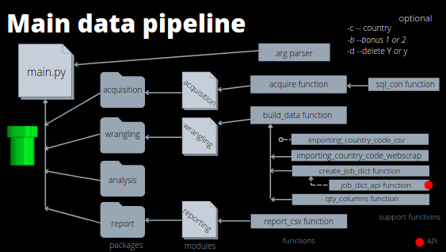
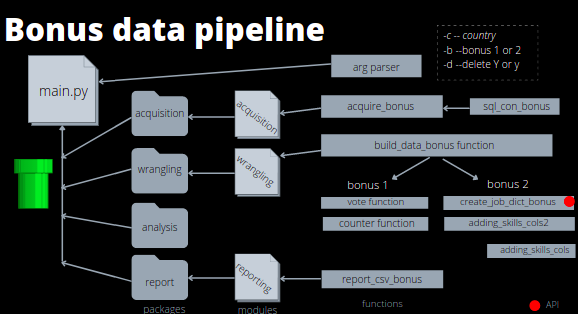

# Project Module 1 README file by Alvaro Rodriguez

## **Introduction and purpose**

This script in Python defines a data pipeline to extract the data from a database, treat it and report it as a csv file. The database is a survey of the opinion and vote intention on the basic income. It  also includes the age, education level and job.

The purpose of this script is to report a csv file with a predefined table format based on the data included in the database.  More details can be found in 'instructions.md'.

The main script file is supported by 4 packages: p_acquisition, p_wrangling, p_analysis and p_reporting. Each package contains a module (script) including the functions to support the main script.

- On the acquisition package, the information is extracted from the database 'raw_data_project_m1.db'. The request is done in SQL, using SQLite 3 library.
- On the wrangling package, the dataframe is cleaned and treated. In some cases, it is required the use of APIs to obtain additional information to transform.
- The analysis package is only a placeholder as the project did not require any specific statistics.
- On the reporting package, the clean dataframe is exported to a csv file.

The folder 'notebooks' and the file 'drafting.ipynb' were used for development phase and it has no actual use.

## **How to use it**
Basically, you just need to run the main.py script with your Python launcher.

There are some optional arguments that can be used:

    -c or --country: this argument is used when the user is only interested in a subset. The csv file will be filtered by the selected country.
    
    -b or --bonus: it can only take values '1' or '2'. It will launch alternative data pipelines.
    
    -d or --delete: when given the values 'Y' or 'y' all the files in the data folder  will be deleted to do a clean download of support information and report.
    
If non-supported values are provided, ValueError is raised, except for delete argument, which ignores the input.

## **Structure**

This is the structure of the main data pipeline:

When given a bonus argument (1 or 2), the alternative pipeline is launched:

The structure is basically the same, but the functions have been adapted to get the requested table format.

The APIs are used to get information from the Internet for treatment of the data. However, to save time, the dictionaries are saved in csv format and accessed in later uses. If you are interested in a clean run (with no previous info), use the argument '-d y'.

The output information will be saved in the 'data' folder.

If the main pipeline is selected but no country is selected, the output will be: 'results.csv'.
If a country is selected, the output will be: '[country]_results.csv'

For the bonus pipeline, the output will be: 'bonus[n].csv' where n is the bonus selected

## **Libraries used**
- [argparse](https://docs.python.org/3/library/argparse.html): for passing arguments on command line
- [os](https://docs.python.org/3/library/os.html): for interaction with the operating system: directories and files.
- [Pandas](https://pandas.pydata.org/pandas-docs/stable/index.html): for data treatment
- [sqlite](https://docs.python.org/3/library/sqlite3.html): for sql queries to the database
- [requests](https://requests.readthedocs.io/en/master/): for api and html queries
- [BeautifulSoup](https://www.crummy.com/software/BeautifulSoup/bs4/doc/): for webscraping the html code
- [re](https://docs.python.org/3/library/re.html): for regular expressions
- [csv](https://docs.python.org/3/library/csv.html): for csv creation and reading
- [tqdm](https://tqdm.github.io/): for progress visualization